# AWS MLOps Churn Prediction Pipeline

An end-to-end MLOps pipeline that trains, evaluates, registers, and auto-deploys
a customer churn prediction model on AWS — with drift monitoring and automated retraining triggers.

## Architecture



## Services Used

| Service | Purpose |
|---|---|
| S3 | Raw data, processed features, model artifacts |
| SageMaker Pipelines | Orchestrated train → evaluate → register workflow |
| SageMaker Model Registry | Model versioning and approval gate |
| EventBridge | Triggers Lambda on model approval |
| Lambda | Auto-deploys approved model to endpoint |
| API Gateway | REST interface for inference (IAM auth) |
| SageMaker Model Monitor | Data drift detection |
| CloudWatch | Metrics, alarms, drift alerts |
| DynamoDB | Inference logs for audit + retraining |
| CloudFormation/SAM | Infrastructure as Code |

## Dataset

[IBM Telco Customer Churn](https://www.kaggle.com/datasets/blastchar/telco-customer-churn)
— 7,000 customers, 20 features, binary churn label.

## Pipeline Steps

1. **Processing** — Feature engineering via SKLearn processor
2. **Training** — XGBoost built-in algorithm
3. **Evaluation** — Generates `model_metrics.json`, checks accuracy threshold (85%)
4. **Condition** — Registers model only if accuracy passes
5. **Auto-deploy** — EventBridge + Lambda deploys approved model to endpoint

## Cost Estimate

| Service | Estimated Cost |
|---|---|
| SageMaker Training (ml.m5.xlarge) | ~$0.10 / run |
| SageMaker Endpoint (ml.t2.medium) | ~$0.05 / hr |
| Lambda + API Gateway | Free tier |
| S3 | < $0.01 |
| CloudWatch + Model Monitor | < $1 / month |
| **Total (dev/demo)** | **< $5** |

## Future Improvement

- Add CI/CD via CodePipeline to retrigger training on new data uploads
- Swap XGBoost for a SageMaker Autopilot run to compare baselines
- Add A/B endpoint routing for shadow model testing

## Setup

```bash
pip install -r requirements.txt
python src/pipeline.py   # kicks off the SageMaker Pipeline
```

## License
MIT
